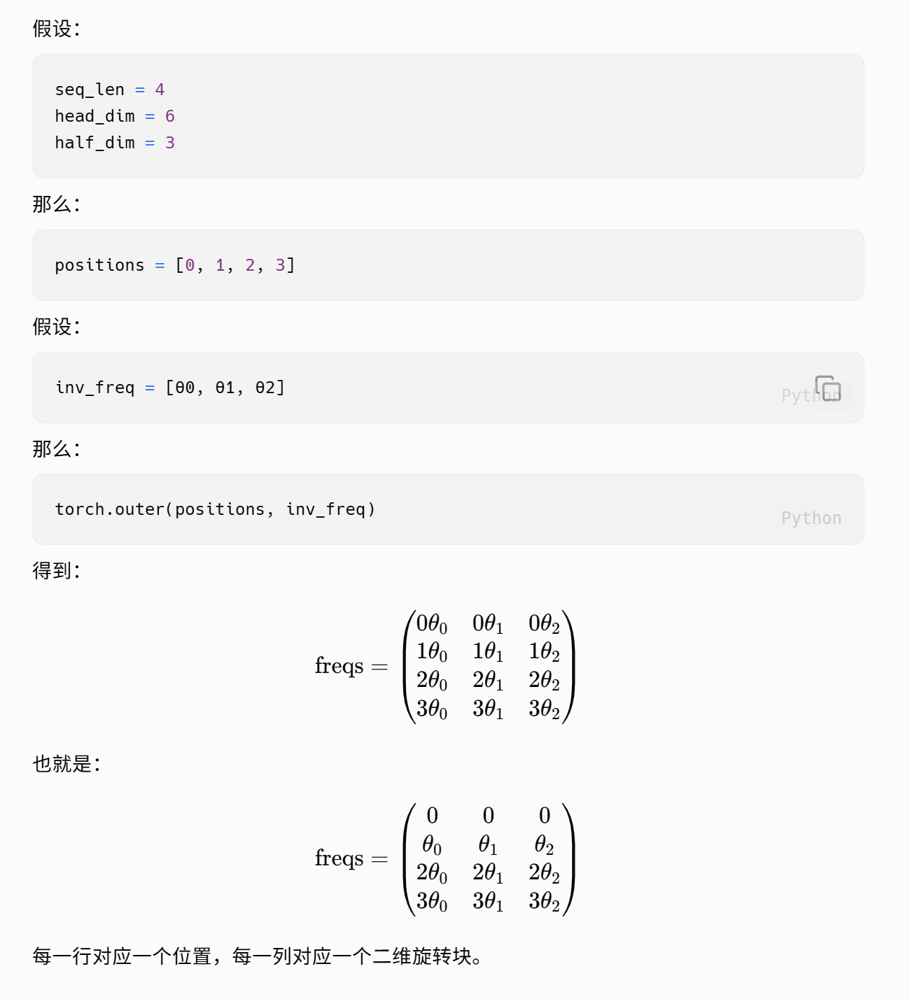
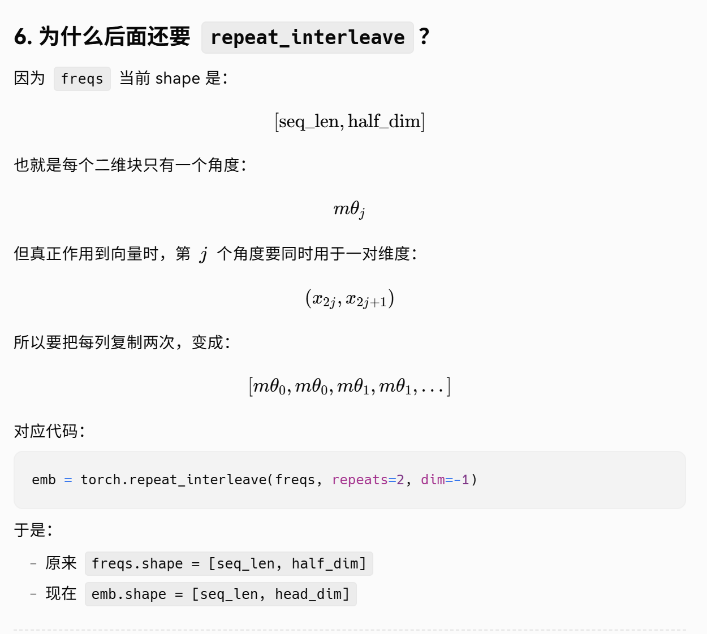
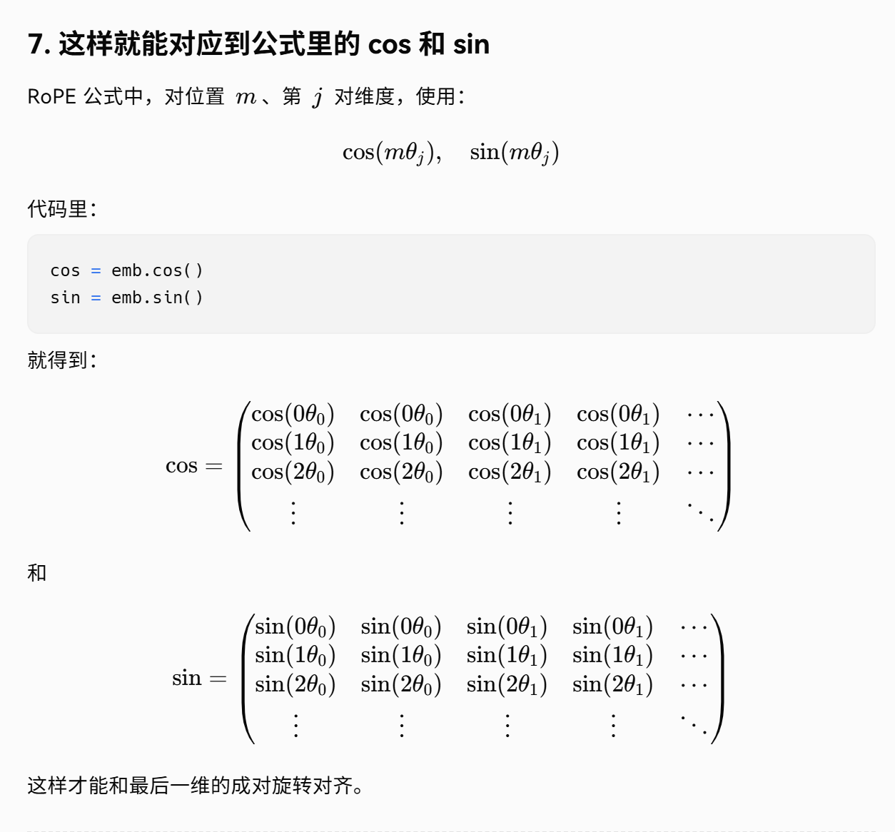
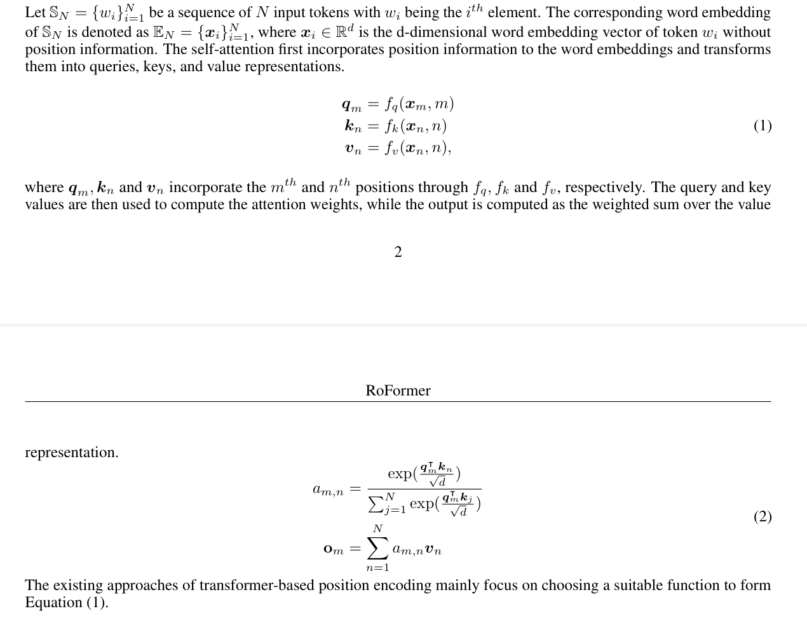

#  RoPE与正余弦位置编码

- **传统正余弦位置编码**：通常是  
  $$
  x + p
  $$
  即 **token embedding 与位置编码逐元素相加**。

- **RoPE（Rotary Position Embedding）**：**不是简单地把 token embedding 和位置编码逐元素相乘**。  
  它的核心做法是：

  > **对注意力里的 $Q$ 和 $K$ 向量按位置做“旋转变换”**，

  而不是直接对输入 embedding 做一个普通乘法。

---

# 1. 先看传统正余弦位置编码

设第 $m$ 个 token 的词向量是

$$
x_m \in \mathbb{R}^d
$$

位置编码是

$$
p_m \in \mathbb{R}^d
$$

那么输入 Transformer 的向量通常是

$$
h_m = x_m + p_m
$$

这里的“加”是逐维相加。

这意味着：

- token 内容信息在 $x_m$ 里
- 位置信息在 $p_m$ 里
- 两者混在同一个向量里送入后续层

---

# 2. RoPE 不是“embedding × position”这么简单

RoPE 的思路不一样。

它不是构造一个位置向量 $p_m$，然后做

$$
x_m \odot p_m
$$

这里 $\odot$ 表示逐元素乘法。  
**RoPE 不是这个。**

RoPE 做的是：

1. 先得到 token 的表示
2. 再线性映射出 $Q$、$K$
3. 对 $Q$、$K$ 的每两维施加一个与位置有关的旋转

即：

$$
q_m \mapsto \operatorname{RoPE}(q_m, m),\qquad
k_m \mapsto \operatorname{RoPE}(k_m, m)
$$

然后再去算注意力分数。

所以 RoPE 的关键不是“加一个位置向量”，也不是“乘一个位置向量”，而是：

> **把向量在二维子空间里旋转一个角度，这个角度由位置决定。**

---

# 3. RoPE 到底“乘”了什么？

如果从矩阵角度说，RoPE 确实可以理解为：

$$
q_m' = R_m q_m,\qquad k_m' = R_m k_m
$$

这里 $R_m$ 是一个由位置 $m$ 决定的**旋转矩阵**。

所以如果你非要说“乘”，那更准确地说是：

> **不是与位置编码向量逐元素相乘，而是左乘一个由位置决定的旋转矩阵。**

这和普通的“乘法位置编码”差别很大。

---

# 4. 为什么说它是“旋转”？

RoPE 把向量的相邻两维看成一组，例如：

$$
(x_1, x_2), (x_3, x_4), \dots
$$

对每一组做二维旋转：

$$
\begin{pmatrix}
x_{2i}'\\
x_{2i+1}'
\end{pmatrix}
=
\begin{pmatrix}
\cos\theta_{m,i} & -\sin\theta_{m,i}\\
\sin\theta_{m,i} & \cos\theta_{m,i}
\end{pmatrix}
\begin{pmatrix}
x_{2i}\\
x_{2i+1}
\end{pmatrix}
$$

其中：

- $m$ 是位置
- $\theta_{m,i}$ 是这个位置对应的旋转角

所以 RoPE 里的“位置”不是一个额外加上的向量，而是体现在：

- 不同位置，旋转不同角度
- 因此 $Q,K$ 的内积会自然携带相对位置信息

---

# 5. 为什么 RoPE 常说能编码“相对位置”？

传统加法位置编码里，位置信息是“塞进表示里”的。  
而 RoPE 的妙处是：注意力分数里会出现“位置差”。

设两个位置 $m,n$，对应旋转后：

$$
q_m' = R_m q_m,\qquad k_n' = R_n k_n
$$

它们的注意力分数是

$$
(q_m')^\top k_n' = (R_m q_m)^\top (R_n k_n)
$$

经过矩阵性质可化成与 $m-n$ 相关的形式。  
所以它天然更适合表达：

> 第 $m$ 个 token 和第 $n$ 个 token 之间的相对距离关系

这就是 RoPE 比“简单加位置向量”更巧妙的地方。


***注：***
$$
\begin{aligned}
R(m\theta)^\intercal R(n\theta) &= \begin{pmatrix} \cos m\theta & \sin m\theta \\ -\sin m\theta & \cos m\theta \end{pmatrix} \begin{pmatrix} \cos n\theta & -\sin n\theta \\ \sin n\theta & \cos n\theta \end{pmatrix} \\[8pt]
&= \begin{pmatrix} \cos m\theta\cos n\theta + \sin m\theta\sin n\theta & -\cos m\theta\sin n\theta + \sin m\theta\cos n\theta \\ -\sin m\theta\cos n\theta + \cos m\theta\sin n\theta & \sin m\theta\sin n\theta + \cos m\theta\cos n\theta \end{pmatrix} \\[8pt]
&= \begin{pmatrix} \cos(n-m)\theta & -\sin(n-m)\theta \\ \sin(n-m)\theta & \cos(n-m)\theta \end{pmatrix} \\[8pt]
&= R((n-m)\theta)
\end{aligned}
$$

即逆时针旋转$(n-m)\theta$。

---

# 旋转位置编码（RoPE）：几何与代数的完美融合

RoPE（Rotary Positional Embedding）的出现，彻底改变了位置编码的格局。它由苏剑林（Su Jianlin）等人提出，并在RoFormer论文中形式化，随后被Meta的Llama系列、Mistral、Google PaLM、DeepSeek等几乎所有现代主流LLM采纳。

RoPE的核心洞察在于：**通过绝对位置的旋转，自然诱导出相对位置的内积性质。** 

### 核心数学推导：从复数域出发

为了理解RoPE，我们首先考虑二维空间的情况。假设我们将Embedding向量的每两个维度视为一个复数 (即，将二维向量构造成复数形式) 。

设 Query 向量 $\boldsymbol{q}$ 和 Key 向量 $\boldsymbol{k}$ 在位置 $m$ 和 $n$ 处的原始值为：

$$\boldsymbol{q} = q_0 + i q_1 = r_q e^{i\theta_q}$$

$$\boldsymbol{k} = k_0 + i k_1 = r_k e^{i\theta_k}$$

传统的APE(Absolute Position Embedding, 绝对位置编码)是做加法：$\boldsymbol{q}' = \boldsymbol{q} + \boldsymbol{p}_m$。

RoPE则是做**乘法（旋转）**。我们将位置 $m$ 编码为一个旋转因子 $e^{im\theta}$：

$$f(\boldsymbol{q}, m) = \boldsymbol{q} \cdot e^{im\theta} = r_q e^{i(\theta_q + m\theta)}$$

$$f(\boldsymbol{k}, n) = \boldsymbol{k} \cdot e^{in\theta} = r_k e^{i(\theta_k + n\theta)}$$

几何上，这相当于把向量在复平面上逆时针旋转了 $m\theta$ 角度。

**奇迹发生在计算内积（Attention Score）时：**

在复数域中，两个向量的内积对应于 Hermitian 内积的实部：

$$\langle f(\boldsymbol{q}, m), f(\boldsymbol{k}, n) \rangle = \text{Re}\left[ f(\boldsymbol{q}, m) \cdot f(\boldsymbol{k}, n)^* \right]$$

代入公式：

$$= \text{Re}\left[ \boldsymbol{q} e^{im\theta} \cdot (\boldsymbol{k} e^{in\theta})^* \right]$$

$$= \text{Re}\left[ \boldsymbol{q} e^{im\theta} \cdot \boldsymbol{k}^* e^{-in\theta} \right]$$

$$= \text{Re}\left[ \boldsymbol{q} \boldsymbol{k}^* \cdot e^{i(m-n)\theta} \right]$$

**关键结论**：最终的内积结果中，位置信息仅以 $(m-n)$ 的形式出现。 这意味着：**尽管我们对每个Token进行了绝对位置的旋转，但它们之间的相互作用（Attention）完全取决于它们的相对距离。** 这一性质被称为**平移不变性（Translation Invariance）**，它是RoPE能够统领江湖的根本原因 。

**注：取实部不会影响相对位置旋转**

看公式：

$$\text{Re}\left[qk^* e^{i\Delta}\right]$$

其中

$$\Delta = (m-n)\theta$$

由于暂时不考虑取值，我们不妨设

$$qk^* = a + ib$$

那么运用欧拉公式得到：

$$\text{Re}\left[(a+ib)e^{i\Delta}\right] = a\cos\Delta - b\sin\Delta$$

可以看到，尽管取实部，但是这里最后的分数里仍然明确含有：
- $\cos\Delta$
- $\sin\Delta$

也就是仍然包含旋转角度 $\Delta$ 的影响。


## 推广到多维空间：分块旋转矩阵

在实际的Transformer中，Embedding维度 $d$ 通常很大（如4096）。RoPE采用“分而治之”的策略，将 $d$ 维向量切分为 $d/2$ 个二维子空间。

对于第 $j$ 个子空间（即第 $2j$ 和 $2j+1$ 维），我们分配一个特定的旋转频率 $\theta_j$。

整个旋转操作可以表示为一个巨大的分块对角矩阵 $\mathbf{R}_{\Theta, m}$ 乘以向量 $\mathbf{x}$：

$$\mathbf{R}_{\Theta, m} = \begin{pmatrix} \cos m\theta_0 & -\sin m\theta_0 & 0 & 0 & \cdots \\ \sin m\theta_0 & \cos m\theta_0 & 0 & 0 & \cdots \\ 0 & 0 & \cos m\theta_1 & -\sin m\theta_1 & \cdots \\ 0 & 0 & \sin m\theta_1 & \cos m\theta_1 & \cdots \\ \vdots & \vdots & \vdots & \vdots & \ddots \end{pmatrix}$$

**频率设定**：RoPE沿用了Vaswani正弦编码的几何级数频率设定：

$$\theta_j = \text{base}^{-2j/d}$$

通常 $\text{base} = 10000$。这意味着：

- **低维度（小 $j$）**：$\theta_j$ 很大，旋转速度快，负责捕捉高频的局部位置信息。
- **高维度（大 $j$）**：$\theta_j$ 很小，旋转速度极慢，负责捕捉低频的全局位置信息。


## 注：复数与二维实向量的对应

这不是任意的定义，而是源于复数 $z = x + iy$ 与二维实向量 $(x, y) \in \mathbb{R}^2$ 的**同构关系**。

## 数学推导

设两个复数：
- $z_1 = x_1 + iy_1$  对应实向量 $\mathbf{v}_1 = (x_1, y_1)$
- $z_2 = x_2 + iy_2$  对应实向量 $\mathbf{v}_2 = (x_2, y_2)$

**二维实向量的欧几里得点积：**
$$\mathbf{v}_1 \cdot \mathbf{v}_2 = x_1x_2 + y_1y_2$$

**复数共轭乘积的实部：**
$$\operatorname{Re}[z_1 \cdot \overline{z_2}] = \operatorname{Re}[(x_1 + iy_1)(x_2 - iy_2)] = \operatorname{Re}[x_1x_2 + y_1y_2 + i(y_1x_2 - x_1y_2)] = x_1x_2 + y_1y_2$$

## 结论

$$\boxed{\langle z_1, z_2 \rangle_{\mathbb{R}^2} = \mathbf{v}_1 \cdot \mathbf{v}_2 = \operatorname{Re}[z_1 \cdot \overline{z_2}]}$$

因此，**Hermitian 内积的实部恰好等于对应实向量的欧几里得内积**。

**注：**

矩阵的共轭，相当于对矩阵中的每一个元素取共轭。注意不会像转置一样交换元素的位置。

## 在 RoPE 等上下文中的意义

在旋转位置编码（RoPE）等场景中：
- $f(\boldsymbol{q}, m)$ 表示带位置 $m$ 的 query 向量（复数形式）
- $f(\boldsymbol{k}, n)$ 表示带位置 $n$ 的 key 向量（复数形式）
- 公式 $\operatorname{Re}[f(\boldsymbol{q}, m) \cdot f(\boldsymbol{k}, n)^*]$ 计算的是**旋转后的实向量相似度**

**关键性质：**
- 旋转等变性：$|z_1 \cdot \overline{z_2}|$ 对旋转不变，而 $\operatorname{Re}[z_1 \cdot \overline{z_2}]$ 保持相对角度信息
- 计算效率：通过复数乘法一次性完成旋转和点积计算
---
## 正余弦编码：相加机制

```python
# 标准 Transformer 的做法
x = token_embedding + positional_encoding  # 逐元素相加

# RoPE 的做法（伪代码）
# 1. 先得到 Q, K（已经包含语义，但还没有位置信息）
q = W_q @ x  # [batch, heads, seq, dim]
k = W_k @ x

# 2. 构造旋转矩阵（由位置决定的角度）
cos, sin = build_rope_cache(seq_len, dim)  # 每个位置有不同的旋转角度

# 3. 应用旋转（不是简单相乘，而是旋转矩阵乘法）
q_rope = q * cos + rotate_half(q) * sin  # 这等价于复数乘法/旋转矩阵
k_rope = k * cos + rotate_half(k) * sin
```
# 关键的计算公式

##  以第 $m$ 个 token为例

在不同维度上的旋转矩阵为：

$$
R^d_{\Theta,m}=
\begin{pmatrix}
\cos m\theta_1 & -\sin m\theta_1 & 0 & 0 & \cdots \\
\sin m\theta_1 & \cos m\theta_1  & 0 & 0 & \cdots \\
0 & 0 & \cos m\theta_2 & -\sin m\theta_2 & \cdots \\
0 & 0 & \sin m\theta_2 & \cos m\theta_2  & \cdots \\
\vdots & \vdots & \vdots & \vdots & \ddots
\end{pmatrix}
$$

作用到向量

$$
x=
\begin{pmatrix}
x_1\\
x_2\\
x_3\\
x_4\\
\vdots\\
x_{d-1}\\
x_d
\end{pmatrix}
$$

得到 $R^d_{\Theta,m}x$。

## 向量拆开写的形式

另一种写法是：

$$
R^d_{\Theta,m}x
=
\begin{pmatrix}
x_1\\
x_2\\
x_3\\
x_4\\
\vdots\\
x_{d-1}\\
x_d
\end{pmatrix}
\odot
\begin{pmatrix}
\cos m\theta_1\\
\cos m\theta_1\\
\cos m\theta_2\\
\cos m\theta_2\\
\vdots\\
\cos m\theta_{d/2}\\
\cos m\theta_{d/2}
\end{pmatrix}
+
\begin{pmatrix}
-x_2\\
x_1\\
-x_4\\
x_3\\
\vdots\\
-x_d\\
x_{d-1}
\end{pmatrix}
\odot
\begin{pmatrix}
\sin m\theta_1\\
\sin m\theta_1\\
\sin m\theta_2\\
\sin m\theta_2\\
\vdots\\
\sin m\theta_{d/2}\\
\sin m\theta_{d/2}
\end{pmatrix}
$$

其中 $\odot$ 表示**按元素乘**（element-wise product，Hadamard 乘）。

---

# 结论先说

这两个式子等价，是因为：

> 每一对维度 $(x_{2j-1}, x_{2j})$ 都在做一次二维旋转，  
> 而二维旋转
>
> $$
> \begin{pmatrix}
> \cos\phi & -\sin\phi\\
> \sin\phi & \cos\phi
> \end{pmatrix}
> \begin{pmatrix}
> a\\
> b
> \end{pmatrix}
> $$
>
> 恰好可以改写成
>
> $$
> \begin{pmatrix}
> a\\
> b
> \end{pmatrix}\cos\phi
> +
> \begin{pmatrix}
> -b\\
> a
> \end{pmatrix}\sin\phi
> $$

然后把所有二维块拼起来，就得到第二种写法。

---


这就是 RoPE 实现里

$$
x\cos + \operatorname{rotate\_half}(x)\sin
$$

的根源。

---

# 扩展
**之前都是选取位置为 m 的token，现在对于整个序列进行分析。**

## 4. 这和 RoPE 推导如何对应？

RoPE 的核心定义是：

对于第 $j$ 对维度：

$$(x_{2j}, x_{2j+1})$$

在位置 $m$ 处，要旋转角度：

$$\phi_{m,j} = m\theta_j$$

所以真正需要的是一个"角度查找表"：

- 行索引 $m$：表示位置
- 列索引 $j$：表示第几个二维块

也就是一个矩阵：

$$\Phi = \begin{pmatrix} 0 \cdot \theta_0 & 0 \cdot \theta_1 & \cdots & 0 \cdot \theta_{h-1} \\ 1 \cdot \theta_0 & 1 \cdot \theta_1 & \cdots & 1 \cdot \theta_{h-1} \\ 2 \cdot \theta_0 & 2 \cdot \theta_1 & \cdots & 2 \cdot \theta_{h-1} \\ \vdots & \vdots & \ddots & \vdots \\ (T-1)\theta_0 & (T-1)\theta_1 & \cdots & (T-1)\theta_{h-1} \end{pmatrix}$$

其中：

- $T = \text{seq\_len}$
- $h = \text{half\_dim} = d/2$

这正是：

$$\Phi = \text{positions} \otimes \text{inv\_freq}$$

所以：

```python
freqs = torch.outer(positions, inv_freq)
```
本质上就是在构造这个角度表 $\Phi$ 。






---

---



--