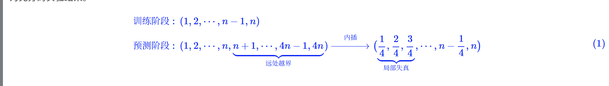
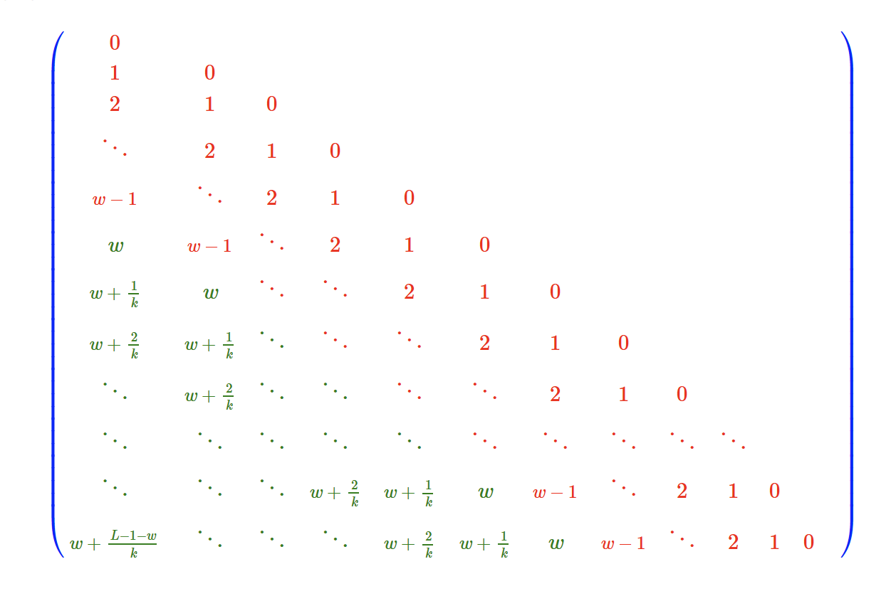
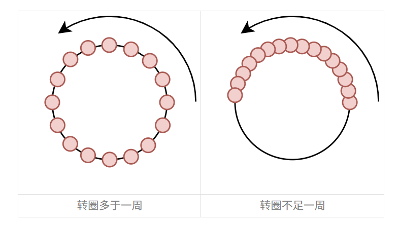

# YaRN

参考[苏剑林博客](https://spaces.ac.cn/archives/9948)

## 为什么引入免训练长度外推技术

顾名思义，免训练长度外推，就是不需要用长序列数据进行额外的训练，只用短序列语料对模型进行训练，就可以得到一个能够处理和预测长序列的模型，即"Train Short, Test Long"。那么如何判断一个模型能否用于长序列呢？最基本的指标就是模型的长序列 Loss 或者 PPL 不会爆炸，更加符合实践的评测则是输入足够长的 Context，让模型去预测答案，然后跟真实答案做对比，算 BLEU、ROUGE 等，LongBench 就是就属于这类榜单。

如果不进行长度外推，如果推理时的相对位置超过训练时的相对位置，就会出现 OOD（Out-Of-Distribution），直接表现就是预测阶段的相对位置超出了训练时的范围，由于没有被训练过，"越界"部分的行为无法预估。

但要注意的是，长度外推应当不以牺牲远程依赖为代价——否则考虑长度外推就没有意义了。

## 位置内插方法的缺陷

窗口截断方法不用多说，它牺牲了远程依赖，自然不好。

另外一种长度外推的方法是位置内插（PI，Position Interpolation），但是它不是免训练的。

它的实现方法非常朴素，将预测的长文本的位置编码乘上因子 $\frac{L_{train}}{L_{test}}$，缩放到训练长度范围内，如下式所示（式中的位置都是相对位置）:

位置内插之后同样会有 PPL（Perplexity，困惑度）爆炸的问题。原因也不难理解，尽管位置内插避免了远处的位置越界问题，但这同时压缩了邻近 Token 的距离，严重扰乱了模型的局部分辨率，而众所周知语言模型本身就是一个非常依赖于局部关系的任务，所以扰乱了局部自然就没法预测准了。

## 长度外推的核心思想1：保近压远

免训练长度外推的要领是"保近压远"，即"保证局部不失真"和"压缩远处不越界"。例如 Leaky ReRoPE 通过一个非常直接的思路实现了这一点：它先设定一个窗口大小 w 内，将相对位置分为两部分，在窗口不改变相对位置实现"局部不失真"，在窗口外使用位置内插实现"远处不越界"，如下式：

## 长度外推的核心思想2：转圈视角

尽管 Leaky ReRoPE 和 ReRoPE 的实际效果相当不错（至少 Loss 如此），但它们跟位置插值一样，都是直接操作位置编号（Position Ids），这给人一种"头疼医头，脚痛医脚"的感觉，欠缺了对内在规律的深入分析。因为对于模型来说，位置编号并不重要，位置嵌入（Position Embeddings）才是跟模型直接交互的，所以想要更深入地"直达病灶"，应该尝试从位置嵌入着手。

可能有读者疑问：位置编号跟位置嵌入不是一一对应吗？操作位置编号不等价于操作位置嵌入？是这样说，但两者的实际表现是不一样的，比如位置编号是无界的，但是位置嵌入是有界的（RoPE 是三角函数组成，三角函数有界），跟模型直接打交道的是位置嵌入，***位置编号 OOD 了，位置嵌入未必 OOD***，所以从位置嵌入角度分析，能更清晰地理解长度外推导致的 OOD 具体是什么表现，从而更加"对症下药"。

在《Transformer 升级之路：2、博采众长的旋转式位置编码》中我们推导 RoPE 的时候，是先利用复数推导了二维的解，然后将多个二维的解拼接成一个高维的解，这样一来，加了 RoPE 之后的 $\boldsymbol{q}, \boldsymbol{k}$ 内积，可以用复数表示为

$$(\mathcal{R}_m \boldsymbol{q})^{\top}(\mathcal{R}_n \boldsymbol{k}) = \text{Re}\left[\sum_{i=0}^{d/2-1} q_{[2i:2i+1]} k_{[2i:2i+1]}^* e^{i(m-n)\theta_i}\right] \tag{4}$$

其中 $\theta_i$ 默认是 $10000^{-2i/d}$，这是一个从 1 渐变到接近于 0 的函数。从欧拉公式 $e^{it} = \cos t + i\sin t$ 可以知道，$e^{i(m-n)\theta_i}$ 实际上就单位圆上的点，当 $m-n$ 逐渐变大时，这个点就在单位圆上转圈（真·旋转），$\theta_i$ 越大则转得越快，反之越慢。

假设训练长度为 $L_{train}$，那么 $m-n \in [0, L_{train}-1]$，接下来让我们充分发挥想象力：较大的 $\theta_i$ 意味着转速越快，周期越短，于是在 $m-n$ 从 0 到 $L_{train}-1$ 期间，它已经被转了很多圈，也就是说圆上的每一个点几乎都被训练过，因此这些 $\theta_i$ 几乎不存在 OOD 问题；相反，对于较小的 $\theta_i$，当 $m-n$ 从 0 到 $L_{train}-1$ 时它可能还没转完一圈，这种情况下被训练过的点顶多只是圆上的一条弧，如果测试时遇到更大的 $L_{test}$，那么就超出了训练过的弧范围，从而有无法预估的表现，这时候就需要通过内插将它压缩到原本的弧内。说白了，位置标号 $m-n$ 是否 OOD 根本不重要，重要的是单位圆上的点是否被充分训练过，如果是，那么就可以不做改动（直接外推），否则就要想办法将它压缩到已经被充分训练过的那段弧上（位置内插）。

具体来说，对于 $\theta_i$，我们可以算出周期为 $T_i = 2\pi/\theta_i$，然后可以算出在训练过程中它所转的"圈数"为 $r_i = \frac{L_{train}}{T_i} = \frac{\theta_i L_{train}}{2\pi}$，我们可以设一个圈数的阈值 $\tau$，圈数超过 $\tau$ 的，就认为已经充分训练了，可以不加改动；圈数少于 1 的，$\theta_i$ 改为 $\frac{\theta_i L_{train}}{L_{test}}$，意味着要把超出弧范围的重新缩放到弧内；至于剩下的部分，就在两者之间线性插值过渡。用公式表达就是：

$$\theta_i^{new} = \left[\gamma_i + (1-\gamma_i)\frac{L_{train}}{L_{test}}\right]\theta_i, \quad \gamma_i = \begin{cases} 1, & r_i &gt; \tau \\ 0, & r_i &lt; 1 \\ \frac{r_i-1}{\tau-1}, & \text{others} \end{cases} \tag{5}$$

这就是《YaRN: Efficient Context Window Extension of Large Language Models》一文所提出的免训练长度外推方案"YaRN"，在笔者的测试中，它的外推效果非常好，只是略逊于 Leaky ReRoPE 和 ReRoPE。但要注意，YaRN 只改变 $\theta_i$ 的值，不改变 Attention 和 RoPE 的形式，因此不会有额外的实现成本和推理成本，在满足这个条件之下（即可以完全代入已有的实现），YaRN 是笔者测试过的效果最佳的长度外推方法。

## 两个主要的思考

第一，对长度外推来说，相对位置的 OOD 不是本质，本质是单位圆上覆盖的点的 OOD；第二，Transformer 建模局部 token 之间的关系，相对位置是很重要的信息，这类信息被大 $\theta$ 编码，对于离得远的 token，主要需要绝对位置信息，这类信息被小 $\theta$ 编码。