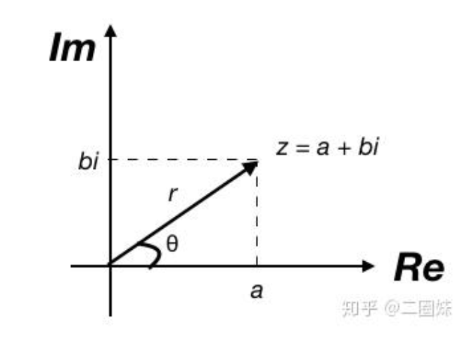
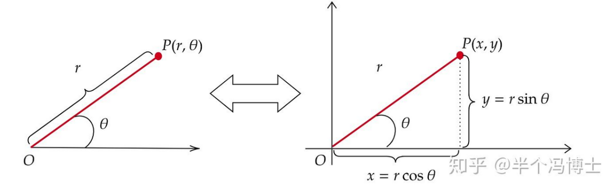
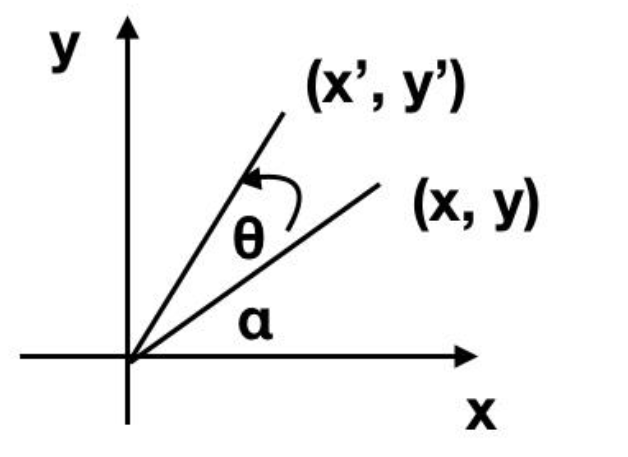

# 定义

复数的定义：

$$
z=a+bi,\quad z\in\mathbb{C},\ a,b\in\mathbb{R},\ i^2=-1
$$
复数可以看做 $(1,i)^T$ 这组基（Basis）的线性组合（Linear Combination），所以可以用向量来表示复数。

$$
z=
\begin{bmatrix}
a\\
b
\end{bmatrix}
$$

---

# 模与共轭

复数的模定义为：

$$
\|z\|=\sqrt{a^2+b^2}
$$

共轭（Conjugate），如果 $z=a+bi$，其共轭：

$$
z^*=a-bi
$$

共轭复数的模相等，均为
$$
\|z\|=\|z^*\|=\sqrt{a^2+b^2}
$$

可以算出：

$$
\|z\|^2=zz^*
$$

对比看它的向量形式：

$$
\begin{bmatrix}
a\\
b
\end{bmatrix}
=
\sqrt{a^2+b^2}
\begin{bmatrix}
\frac{a}{\sqrt{a^2+b^2}}\\[6pt]
\frac{b}{\sqrt{a^2+b^2}}
\end{bmatrix}
=
\|z\|
\begin{bmatrix}
\frac{a}{\|z\|}\\[6pt]
\frac{b}{\|z\|}
\end{bmatrix}
=
\|z\|
\begin{bmatrix}
\cos\theta\\
\sin\theta
\end{bmatrix}
$$

所以复数有极坐标形式，经常被写作：

$$
z=r(\cos\theta+i\sin\theta)
$$

其中$r$即$\|z\|$。

又通过欧拉公式

$$
e^{ix}=\cos x+i\sin x
$$

可以写作：

$$
z=re^{i\theta}
$$

---

# 单位向量表示

向量

$$
\begin{bmatrix}
\frac{a}{\|z\|}\\[6pt]
\frac{b}{\|z\|}
\end{bmatrix}
$$

长度为 $1$，因为

$$
\left(\frac{a}{\|z\|}\right)^2+\left(\frac{b}{\|z\|}\right)^2
=
\frac{a^2+b^2}{\|z\|^2}
=
\frac{a^2+b^2}{a^2+b^2}
=1
$$

所以它是一个单位向量。

平面上任意单位向量都可以表示成

$$
\begin{bmatrix}
\cos\theta\\
\sin\theta
\end{bmatrix}
$$

其中 $\theta$ 是这个向量与 $x$ 轴正方向的夹角。

因此

$$
\frac{a}{\|z\|}=\cos\theta,\qquad
\frac{b}{\|z\|}=\sin\theta
$$

于是就得到

$$
\begin{bmatrix}
a\\
b
\end{bmatrix}
=
\|z\|
\begin{bmatrix}
\cos\theta\\
\sin\theta
\end{bmatrix}
$$

这就是截图中的最后一步。

## 注：直角坐标系与极坐标系的相互转换

将一个点 $P(r,\theta)$ 转换为平面坐标系 $P(x,y)$ 其实非常简单，只需要一个三角形，如下图：

图中所示的方法可应用于极坐标和直角坐标的**相互转换**。
---

# 乘法

复数的乘法：

设

$$
z_1=a+bi,\qquad z_2=c+di
$$

则

$$
z_1z_2=(a+bi)(c+di)
=ac-bd+(bc+ad)i
$$

可以把它看做一个矩阵和一个向量相乘：

$$
z_1z_2= \begin{bmatrix}
a & -b\\
b & a
\end{bmatrix}
\begin{bmatrix}
c\\
d
\end{bmatrix}
$$

所以复数$z_1$也可以看成矩阵：

$$
z_1=\begin{bmatrix}
a & -b\\
b & a
\end{bmatrix}
$$

把 $z_2$ 也换成对应的矩阵：

$$
z_2=\begin{bmatrix}
c & -d\\
d & c
\end{bmatrix}
$$

于是

$$
z_1z_2=
\begin{bmatrix}
a & -b\\
b & a
\end{bmatrix}
\begin{bmatrix}
c & -d\\
d & c
\end{bmatrix}
=
\begin{bmatrix}
ac-bd & -(ad+bc)\\
ad+bc & ac-bd
\end{bmatrix}
$$

这也足以证明复数看成矩阵是正确的，所以复数相乘这个运算，也可以看成是矩阵变换。

$1$ 可以等价地看成 $z=1+0i$，其矩阵形式为：

$$
\begin{bmatrix}
1 & 0\\
0 & 1
\end{bmatrix}
$$

即单位矩阵$I$。

$i$ 为 $z=0+1i$，等价于

$$
\begin{bmatrix}
0 & -1\\
1 & 0
\end{bmatrix}
$$

于是

$$
i^2=i\cdot i=
\begin{bmatrix}
0 & -1\\
1 & 0
\end{bmatrix}
\begin{bmatrix}
0 & -1\\
1 & 0
\end{bmatrix}
=
\begin{bmatrix}
-1 & 0\\
0 & -1
\end{bmatrix}
=-I=-1
$$

这也说明了矩阵形式的正确性。

同时无论用代数形式或者向量形式，都可以验证复数的乘法满足交换律。

## 注：复数到二阶矩阵的同构映射

对于复数：

$$
z=a+bi
$$

它到特定二阶矩阵的同构映射为：

$$
z=
\begin{bmatrix}
a & -b\\
b & a
\end{bmatrix}
$$

## 注：什么是同构映射？

### 直观理解

“同构”可以理解为：

> 两个对象表面上长得不一样，但它们的内部运算规则完全一致。

也就是说，我们可以用一种“翻译规则”，把一个系统里的元素翻译到另一个系统里，而且：

- 加法对应加法
- 乘法对应乘法
- 零元、单位元都对应
- 不同元素不会被翻译成同一个元素
- 对方系统里的每个元素都能被翻译回来

这样的“翻译”就叫**同构映射**。

### 数学上的定义

设有两个代数结构 $A,B$，映射

$$
\varphi:A\to B
$$

如果满足：

#### (1) 保持运算

例如对任意 $x,y\in A$，有

$$
\varphi(x+y)=\varphi(x)+\varphi(y)
$$

$$
\varphi(xy)=\varphi(x)\varphi(y)
$$

如果还涉及数乘，也要求保持数乘。

### (2) 双射

也就是：

- **单射**：不同元素映成不同元素
- **满射**：目标集合中每个元素都能被某个原像得到

那么 $\varphi$ 就叫做一个同构映射，$A,B$ 就叫同构。

---

# 复数的几种看法

所以上述给了我们几种看待复数的方式：

**代数：**

$$
z=a+bi
$$

**向量：**

$$
z=
\begin{bmatrix}
a\\
b
\end{bmatrix}
$$

**矩阵：**

$$
z=
\begin{bmatrix}
a & -b\\
b & a
\end{bmatrix}
$$

**极坐标：**

$$
z=r(\cos\theta+i\sin\theta)
$$

**指数形式：**

$$
z=re^{i\theta}
$$

---

# 复数相乘与 2D 旋转

所以如果我们跟一个复数相乘，那么所做的矩阵变换是：

$$
z=
\begin{bmatrix}
a & -b\\
b & a
\end{bmatrix}
=
\sqrt{a^2+b^2}
\begin{bmatrix}
\frac{a}{\sqrt{a^2+b^2}} & -\frac{b}{\sqrt{a^2+b^2}}\\[6pt]
\frac{b}{\sqrt{a^2+b^2}} & \frac{a}{\sqrt{a^2+b^2}}
\end{bmatrix}
$$

由于

$$
\frac{a}{\|z\|}=\cos\theta,\qquad \frac{b}{\|z\|}=\sin\theta
$$

所以

$$
z=
\|z\|
\begin{bmatrix}
\cos\theta & -\sin\theta\\
\sin\theta & \cos\theta
\end{bmatrix}
$$

进一步也可以写成

$$
z=
\|z\|\cdot I
\begin{bmatrix}
\cos\theta & -\sin\theta\\
\sin\theta & \cos\theta
\end{bmatrix}
=
\begin{bmatrix}
\|z\| & 0\\
0 & \|z\|
\end{bmatrix}
\begin{bmatrix}
\cos\theta & -\sin\theta\\
\sin\theta & \cos\theta
\end{bmatrix}
$$

其中矩阵

$$
\begin{bmatrix}
\cos\theta & -\sin\theta\\
\sin\theta & \cos\theta
\end{bmatrix}
$$

就是 2D 平面上的旋转矩阵。

如果 $\|z\|=1$，那么复数可以用一个单位向量表示，同时这个乘法只做旋转变换。

---

# 旋转矩阵的推导

设一个点的坐标是 $(x,y)$， 把它写成极坐标形式：

$$
x=\rho\cos\varphi,\qquad y=\rho\sin\varphi
$$

这里：

- $\rho$ 是点到原点的距离
- $\varphi$ 是它和 $x$ 轴正方向的夹角

所以这个点可以写成向量：

$$
\begin{pmatrix}
x\\
y
\end{pmatrix}
=
\begin{pmatrix}
\rho\cos\varphi\\
\rho\sin\varphi
\end{pmatrix}
$$

## 如果把这个点***逆时针***旋转 $\theta$

旋转以后，它到原点的距离不变，角度变成

$$
\varphi+\theta
$$

所以新坐标是

$$
x'=\rho\cos(\varphi+\theta),\qquad
y'=\rho\sin(\varphi+\theta)
$$

利用三角恒等式：

$$
\cos(\varphi+\theta)=\cos\varphi\cos\theta-\sin\varphi\sin\theta
$$

$$
\sin(\varphi+\theta)=\sin\varphi\cos\theta+\cos\varphi\sin\theta
$$

于是

$$
x'=\rho(\cos\varphi\cos\theta-\sin\varphi\sin\theta)
$$

$$
y'=\rho(\sin\varphi\cos\theta+\cos\varphi\sin\theta)
$$

由于

$$
x=\rho\cos\varphi,\qquad y=\rho\sin\varphi
$$

代入得

$$
x'=x\cos\theta-y\sin\theta
$$

$$
y'=x\sin\theta+y\cos\theta
$$

把它写成矩阵形式就是

$$
\begin{pmatrix}
x'\\
y'
\end{pmatrix}
=
\begin{pmatrix}
\cos\theta & -\sin\theta\\
\sin\theta & \cos\theta
\end{pmatrix}
\begin{pmatrix}
x\\
y
\end{pmatrix}
$$

这就证明了：这个矩阵就是旋转矩阵。

## 注：乘以虚数单位 $i$（作为矩阵）

在复数与 $2\times2$ 实矩阵的对应中，$i$ 对应矩阵：

$$J = \begin{bmatrix} 0 & -1 \\ 1 & 0 \end{bmatrix}$$

**效果：逆时针旋转 90°（$\frac{\pi}{2}$ 弧度）**

验证：
- $J \cdot \begin{bmatrix} 1 \\ 0 \end{bmatrix} = \begin{bmatrix} 0 \\ 1 \end{bmatrix}$  （x轴单位向量 → y轴单位向量）
- $J \cdot \begin{bmatrix} 0 \\ 1 \end{bmatrix} = \begin{bmatrix} -1 \\ 0 \end{bmatrix}$ （y轴单位向量 → 负x轴）

这正是**逆时针旋转 90°** 的变换！

---

# 乘复数等同于"旋转+缩放"

因为复数本身可以写成极形式：

$$z = a+bi = r(\cos\theta + i\sin\theta)$$

其中

$$r = |z| = \sqrt{a^2 + b^2}$$

并且

$$a = r\cos\theta, \quad b = r\sin\theta$$

把这两个式子代入二阶同构矩阵 $A$：

$$A = \begin{pmatrix} a & -b \\ b & a \end{pmatrix} = \begin{pmatrix} r\cos\theta & -r\sin\theta \\ r\sin\theta & r\cos\theta \end{pmatrix}$$

把 $r$ 提出来：

$$A = r\begin{pmatrix} \cos\theta & -\sin\theta \\ \sin\theta & \cos\theta \end{pmatrix}$$

这一步是核心。

因为右边那个矩阵

$$R_\theta = \begin{pmatrix} \cos\theta & -\sin\theta \\ \sin\theta & \cos\theta \end{pmatrix}$$

正是二维平面上**逆时针旋转 $\theta$** 的矩阵。

所以

$$A = rR_\theta$$

就表示：

1. 先做旋转 $R_\theta$
2. 再整体放大 $r$ 倍

也就是：

> **乘以复数 $z$，等价于"旋转 $\theta$ 再缩放 $r$ 倍"。**

---

因为

$$A = \begin{pmatrix} a & -b \\ b & a \end{pmatrix} = r\begin{pmatrix} \cos\theta & -\sin\theta \\ \sin\theta & \cos\theta \end{pmatrix}$$

对任意向量 $\begin{pmatrix} x \\ y \end{pmatrix}$，有

$$A\begin{pmatrix} x \\ y \end{pmatrix} = r\begin{pmatrix} \cos\theta & -\sin\theta \\ \sin\theta & \cos\theta \end{pmatrix}\begin{pmatrix} x \\ y \end{pmatrix}$$

这表示：
- 先由旋转矩阵把向量旋转 $\theta$
- 再由前面的 $r$ 把长度乘上 $r$

---