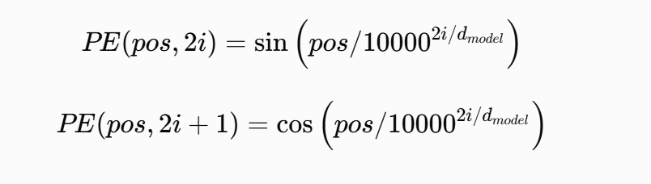
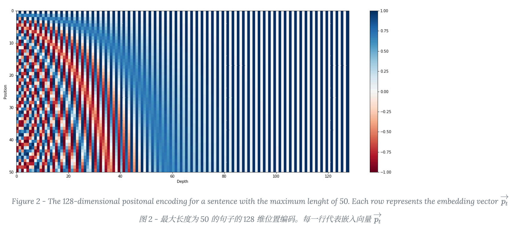
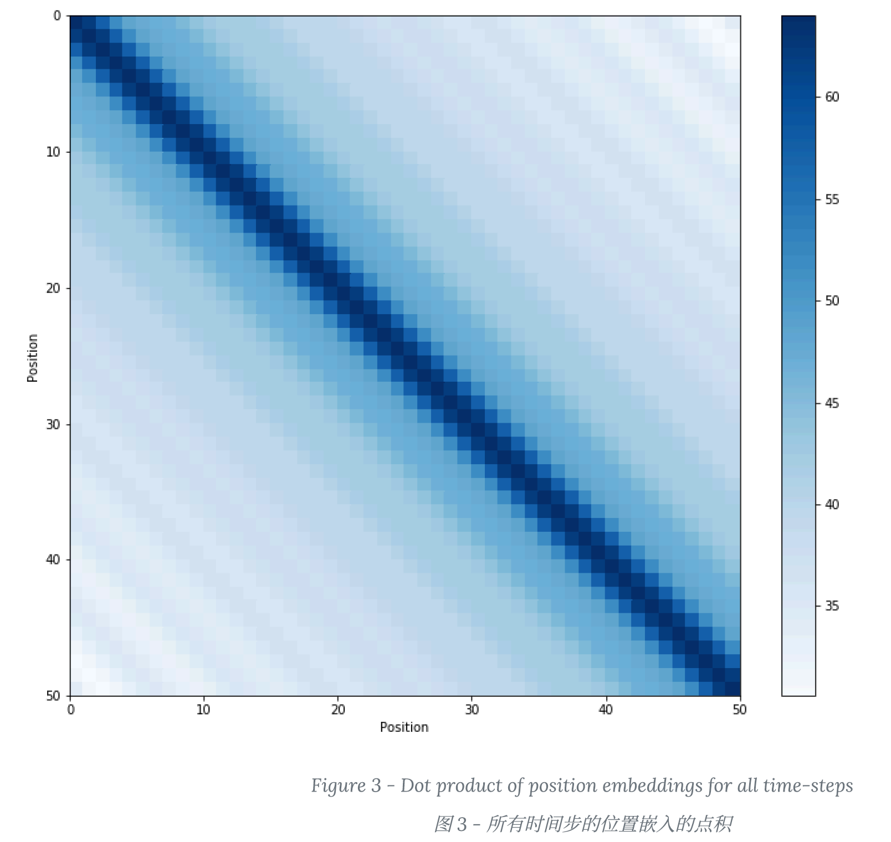
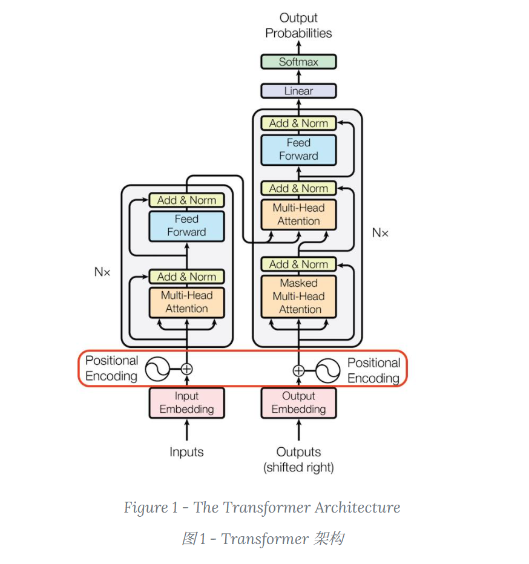

# Transformer 中的正余弦位置编码

这篇[博客](https://kazemnejad.com/blog/transformer_architecture_positional_encoding/)解释得非常清楚。  
如果网页失效了，可以参看备份的 [PDF 文档](./ref/Transformer%20架构：位置编码%20-%20Amirhossein%20Kazem...pdf)。

这里仅对文中一些部分进行补充。

---

## 补充

### 1. 正余弦位置编码矩阵的热力图

对于下面的正余弦位置编码公式：

我们可以生成一张编码矩阵的热力图如下：

- **纵轴 Position**：序列中的位置，比如第 0 个 token、第 1 个 token、第 2 个 token……
- **横轴 Depth**：位置编码向量的维度，也就是 embedding 的各个通道

从图中可以看到：

- 当 `PE = 1` 时，热点为蓝色
- 当 `PE = -1` 时，热点为红色

当 `Depth` 比较小时，我们可以看到不同 `position` 的热点颜色变化很明显。  
这也很好理解，因为此时 `PE` 计算公式中的分母很小，所以分子 `pos` 对值的影响很大。

反之，当 `Depth` 比较大时，不同 `position` 的热点颜色基本不再变化。

---

### 2. 位置编码两两做点积后的相似度矩阵

下面这幅图表达的是：**不同位置的位置编码之间，两两做点积后的相似度矩阵**。

颜色含义如下：

- **颜色越深（深蓝）**：点积越大，说明两个位置编码越相似
- **颜色越浅**：点积越小，说明两个位置编码越不相似

主对角线对应的是：

`PE(i) · PE(i)`

也就是一个向量和自己做点积。  
这其实就是向量的平方范数，通常最大，所以主对角线颜色最深。

> 注：如果写成两个不同位置之间的点积，则应为 `PE(i) · PE(j)`。

---

### 3. 正余弦位置编码的缺陷

在 Transformer 中，嵌入操作通常包括 **token embedding** 和 **position encoding** 相加，如下：

然而，以两个向量相加为例：

如果是“向量 A + 位置向量”，我们理想上希望最终结果只是**方向发生变化**，从而突出“位置变化”的特点；  
但实际上，求和操作不仅会改变方向，也可能改变向量长度。

这也是后续会出现 **RoPE（Rotary Position Embedding）** 的一个原因：  
它希望让位置编码更多体现在**旋转方向**上，而不是简单加法带来的长度变化。

---

### 4. 示例代码

示例代码见：

[sinusoidal.py](./code/sinusoidal.py)